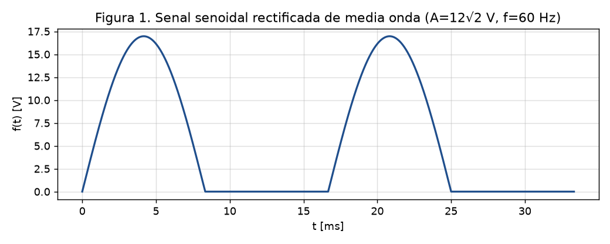
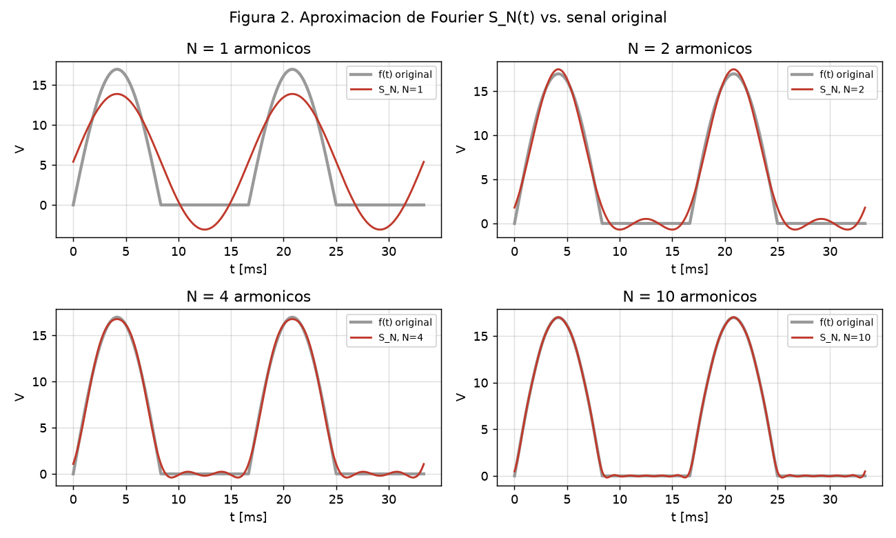
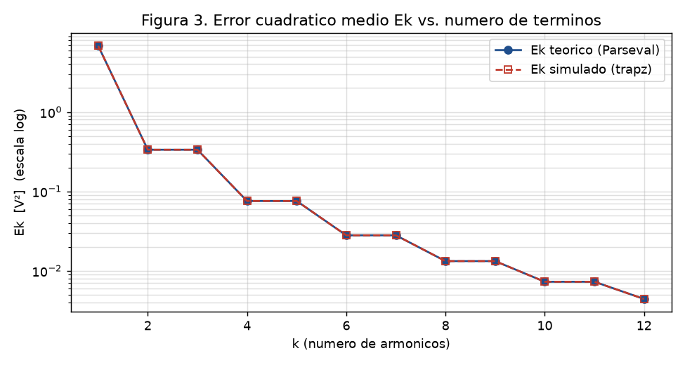

<!--
DOCUMENTO PARA EXPORTAR A PDF (Proyecto 1 - PROY / APF).
Exportar con:  uv run --with pypandoc python utils/md_to_docx.py "cursos/2026-1/SeriesTransformadas/TrabajoFinal/Proyecto1/05 - Documento final.md"
El .docx sale con Arial 12 / interlineado 1.5 (plantilla reference-apa7.docx). Verificar 10-20 paginas.
Las imagenes usan ruta estandar attachments/... para que pandoc las incruste (--resource-path = carpeta de la nota).
-->

# Análisis de una señal senoidal rectificada de media onda mediante series de Fourier y su aproximación en GNU Octave

**Curso:** Series y Transformadas — UTP, ciclo 2026-1
**Docente:** J. F. Torres
**Modalidad:** _(individual / grupal — completar)_
**Integrante(s):** _(nombres y códigos)_
**Fecha:** julio de 2026

---

> [!note] Lista de figuras y tablas
> **Figuras:** Fig. 1 señal rectificada de media onda · Fig. 2 aproximación $S_N(t)$ para $N=1,2,4,10$ · Fig. 3 error cuadrático medio $E_k$ vs. $k$.
> **Tablas:** Tabla 1 coeficientes de Fourier · Tabla 2 error cuadrático teórico · Tabla 3 comparación error teórico vs. simulado.

## 1. Introducción

La conversión de corriente alterna en corriente continua es una de las operaciones más frecuentes en la electrónica de potencia: prácticamente todo equipo alimentado desde la red requiere una etapa de **rectificación** que transforme la señal senoidal de entrada en una señal de un solo signo. El **rectificador de media onda** —el más simple de estos circuitos, construido con un único diodo— deja pasar únicamente el semiciclo positivo de la senoide y bloquea el negativo (Boylestad & Nashelsky, 2009). El resultado es una señal periódica pero **fuertemente no senoidal**, con un valor promedio (componente continua) útil y un **rizado** que debe caracterizarse para diseñar el filtro posterior.

En el marco de la empresa *Electronics S.A.*, que necesita generar una señal senoidal rectificada de media onda para una aplicación específica, surge la pregunta de ingeniería que motiva este trabajo: **¿cómo se descompone esa señal en sus componentes de frecuencia y cuántos de esos componentes hacen falta para reproducirla con fidelidad suficiente?** La herramienta matemática adecuada es la **serie de Fourier**, que expresa cualquier señal periódica como una suma de senoides armónicamente relacionadas (Hsu, 1973). Conocer la amplitud de cada armónico permite dimensionar el filtro, estimar el contenido de rizado y cuantificar el error de cualquier aproximación finita.

**Objetivo principal.** Obtener, por vía **analítica** y por **simulación en GNU Octave**, la serie de Fourier de una señal senoidal rectificada de media onda, y **comparar ambos resultados mediante el error cuadrático medio**, verificando que teoría y simulación coinciden.

**Objetivos específicos.** (1) Definir la señal con parámetros de ingeniería realistas y calcular sus coeficientes de Fourier resolviendo las integrales paso a paso; (2) implementar en Octave la reconstrucción de la señal con $N$ términos y graficar la aproximación frente a la señal original; (3) calcular el error cuadrático medio por teoría (relación de Parseval) y por simulación (integración numérica) y discutir su convergencia.

## 2. Marco teórico

### 2.1. Serie de Fourier

Una función periódica $f(t)$ de periodo $T$ puede desarrollarse como una **serie de Fourier** (Hsu, 1973; Oppenheim & Willsky, 1998):

$$f(t) = \frac{1}{2}a_0 + \sum_{n=1}^{\infty}\bigl(a_n\cos n\omega_0 t + b_n\sin n\omega_0 t\bigr), \qquad \omega_0 = \frac{2\pi}{T}$$

donde $\omega_0$ es la **frecuencia angular fundamental** y $n$ el número de armónico. El término $\tfrac{1}{2}a_0$ representa el **valor promedio** (componente continua) de la señal.

Los coeficientes se obtienen aprovechando la **ortogonalidad** de las funciones seno y coseno sobre un periodo: al multiplicar la serie por $\cos n\omega_0 t$ (o $\sin n\omega_0 t$) e integrar, sobrevive un único término. Resultan las fórmulas de proyección:

$$a_0 = \frac{2}{T}\int_{T} f(t)\,dt, \qquad a_n = \frac{2}{T}\int_{T} f(t)\cos n\omega_0 t\,dt, \qquad b_n = \frac{2}{T}\int_{T} f(t)\sin n\omega_0 t\,dt$$

### 2.2. Simetrías

El análisis de **paridad** simplifica el cálculo: si $f$ es par, $b_n=0$ (serie de cosenos); si es impar, $a_0=a_n=0$ (serie de senos). La señal de este trabajo **no posee simetría** —al anularse durante medio periodo no es ni par ni impar—, por lo que deben calcularse los tres coeficientes.

### 2.3. Aproximación finita y error cuadrático medio

En la práctica la serie se **trunca** a $k$ armónicos, obteniendo la suma parcial $S_k(t)$. La calidad de esa aproximación se mide con el **error cuadrático medio** (Hsu, 1973):

$$E_k = \frac{1}{T}\int_{T}\bigl[f(t)-S_k(t)\bigr]^2 dt$$

que, desarrollando el cuadrado y usando la ortogonalidad, se reduce a la forma de **Parseval truncada**:

$$E_k = \underbrace{\frac{1}{T}\int_{T}[f(t)]^2 dt}_{\text{potencia media}} - \frac{a_0^2}{4} - \frac{1}{2}\sum_{n=1}^{k}\bigl(a_n^2 + b_n^2\bigr)$$

$E_k$ es la **potencia residual** no capturada por los primeros $k$ términos; decrece monótonamente con $k$. En señales **continuas** (sin discontinuidades) no aparece el **fenómeno de Gibbs** —la sobreoscilación persistente cerca de los saltos— y la convergencia es rápida.

### 2.4. El simulador: GNU Octave

**GNU Octave** es un lenguaje interpretado de alto nivel para cálculo numérico, de código abierto y ampliamente compatible con MATLAB (Eaton et al., 2024). Permite definir vectores de tiempo, evaluar funciones elementales (`sin`, `cos`, `abs`), realizar sumatorias con bucles `for`, integrar numéricamente (`trapz`) y **graficar** señales (`plot`, `semilogy`). Estas capacidades bastan para reconstruir una serie de Fourier y cuantificar su error, por lo que se emplea como simulador en este proyecto.

## 3. Desarrollo — solución teórica

### 3.1. Definición de la señal

Se modela el secundario de un transformador que reduce la red peruana (220 V RMS, 60 Hz) a **12 V RMS**, rectificado en media onda. La amplitud pico es $A = 12\sqrt{2} \approx 16{,}97$ V y el periodo $T = 1/60$ s, de donde $\omega_0 = 2\pi/T = 120\pi \approx 376{,}99$ rad/s. La señal, en un periodo, es:

$$f(t) = \begin{cases} A\sin(\omega_0 t), & 0 \le t < T/2 \\ 0, & T/2 \le t < T \end{cases}$$



Al ser $f(t)=0$ en la segunda mitad del periodo, todas las integrales se reducen al intervalo $[0,\,T/2]$.

### 3.2. Término constante

$$a_0 = \frac{2}{T}\int_0^{T/2} A\sin(\omega_0 t)\,dt = \frac{2A}{T\omega_0}\bigl[-\cos\omega_0 t\bigr]_0^{T/2} = \frac{2A}{T\omega_0}(1+1) = \frac{4A}{T\omega_0} = \frac{2A}{\pi}$$

El valor promedio es $\tfrac{1}{2}a_0 = A/\pi \approx 5{,}40$ V: la componente continua que el rectificador entrega a la carga.

### 3.3. Coeficientes de cosenos

Aplicando $\sin\alpha\cos\beta = \tfrac{1}{2}[\sin(\alpha+\beta)+\sin(\alpha-\beta)]$ y el resultado $\int_0^{T/2}\sin(m\omega_0 t)\,dt = \frac{1-(-1)^m}{m\omega_0}$ (nulo si $m$ par, $\tfrac{2}{m\omega_0}$ si $m$ impar), se obtiene, tratando **aparte** el caso $n=1$:

$$a_1 = 0; \qquad a_n = -\frac{2A}{\pi(n^2-1)}\ \ (n\ \text{par}); \qquad a_n = 0\ \ (n\ \text{impar} \ge 3)$$

### 3.4. Coeficientes de senos

Con $\sin\alpha\sin\beta = \tfrac{1}{2}[\cos(\alpha-\beta)-\cos(\alpha+\beta)]$, el caso $n=1$ produce $\int_0^{T/2}[1-\cos 2\omega_0 t]\,dt = T/2$, y para $n\ge 2$ las integrales de cosenos enteros se anulan:

$$b_1 = \frac{A}{2} \approx 8{,}49\ \text{V}; \qquad b_n = 0\ \ (n \ge 2)$$

**Tabla 1.** Coeficientes de Fourier no nulos ($A = 16{,}97$ V).

| Componente | Símbolo | Expresión | Valor [V] |
| ---------- | ------- | --------- | --------- |
| Continua (DC) | $a_0/2$ | $A/\pi$ | $5{,}402$ |
| Fundamental (seno) | $b_1$ | $A/2$ | $8{,}485$ |
| Armónico 2 (coseno) | $a_2$ | $-2A/3\pi$ | $-3{,}601$ |
| Armónico 4 | $a_4$ | $-2A/15\pi$ | $-0{,}720$ |
| Armónico 6 | $a_6$ | $-2A/35\pi$ | $-0{,}309$ |
| Armónico 8 | $a_8$ | $-2A/63\pi$ | $-0{,}171$ |
| Armónico 10 | $a_{10}$ | $-2A/99\pi$ | $-0{,}109$ |

### 3.5. Serie de Fourier resultante

Reuniendo los términos no nulos y reindexando los pares como $n=2k$:

$$\boxed{\;f(t) = \frac{A}{\pi} + \frac{A}{2}\sin(\omega_0 t) - \frac{2A}{\pi}\sum_{k=1}^{\infty}\frac{\cos(2k\,\omega_0 t)}{4k^2-1}\;}$$

La señal se compone de: un **nivel DC** ($A/\pi$), un **rizado fundamental** a 60 Hz de amplitud $A/2$, y una cola de **armónicos pares** (120, 240, 360 Hz…) que decae como $1/(4k^2-1)$. El desarrollo completo paso a paso, con el tratamiento del caso $n=1$, se recoge en el desarrollo analítico de la Etapa T.

### 3.6. Error cuadrático medio teórico

La potencia media de la señal es $\tfrac{1}{T}\int_0^{T} f^2\,dt = \tfrac{A^2}{T}\int_0^{T/2}\sin^2\omega_0 t\,dt = A^2/4 = 72{,}0$ V². Sustituyendo los coeficientes en la fórmula de Parseval truncada se obtiene la Tabla 2.

**Tabla 2.** Error cuadrático medio teórico $E_k$.

| $k$ | $E_k$ [V²] | Potencia residual $E_k/P$ |
| --- | ---------- | ------------------------- |
| 1 | $6{,}8195$ | $9{,}47\%$ |
| 2 | $0{,}33494$ | $0{,}465\%$ |
| 4 | $0{,}075561$ | $0{,}105\%$ |
| 6 | $0{,}027919$ | $0{,}0388\%$ |
| 10 | $0{,}0072607$ | $0{,}0101\%$ |

## 4. Desarrollo — solución por simulación

Se implementó el script `proyecto1_fourier.m` en GNU Octave (código completo en el **Anexo A**). El programa define la señal mediante la máscara `A*sin(w0*t).*(sin(w0*t)>=0)`, reconstruye la suma parcial $S_N(t)$ en un bucle `for` con los coeficientes teóricos, y calcula el error simulado integrando $[f-S_k]^2$ con `trapz` sobre un vector de tiempo de paso $\approx T/4000$.

La Figura 2 superpone la señal original y su aproximación para $N = 1, 2, 4$ y $10$ armónicos.



Con $N=1$ (DC + fundamental) la aproximación es pobre: la senoide no logra anular el semiciclo "apagado" y desciende a valores negativos. Al incorporar el **segundo armónico** ($N=2$) la curva ya aplana el tramo cero y sigue la joroba positiva. Para $N=4$ y $N=10$ la reconstrucción es visualmente indistinguible de la señal original, y —al ser una señal continua— **no se observa sobreoscilación de Gibbs**.

La Figura 3 muestra el error cuadrático medio frente al número de términos, en escala semilogarítmica, para las curvas teórica y simulada.



El error decae en forma de **escalera**: cada peldaño descendente corresponde a un armónico **par** nuevo, mientras que los armónicos impares (de coeficiente nulo) producen las mesetas horizontales. Ambas curvas se solapan por completo.

## 5. Discusión y conclusiones

### 5.1. Comparación teórico vs. simulado (con el error)

La Tabla 3 confronta el error cuadrático medio obtenido por la fórmula analítica de Parseval y por integración numérica en Octave.

**Tabla 3.** Error cuadrático medio: teórico vs. simulado.

| $k$ | $E_k$ teórico [V²] | $E_k$ simulado [V²] | Diferencia relativa |
| --- | ------------------ | ------------------- | ------------------- |
| 1 | $6{,}81950$ | $6{,}81950$ | $<0{,}001\%$ |
| 2 | $0{,}334943$ | $0{,}334944$ | $<0{,}001\%$ |
| 4 | $0{,}0755611$ | $0{,}0755617$ | $0{,}001\%$ |
| 6 | $0{,}0279195$ | $0{,}0279199$ | $0{,}002\%$ |
| 10 | $0{,}00726069$ | $0{,}00726096$ | $0{,}004\%$ |

La coincidencia es **inferior al 0,01 %** en todo el rango. El pequeño residuo crece con $k$ porque los armónicos altos exigen más resolución temporal a la cuadratura numérica; con el paso empleado es despreciable.

### 5.2. Conclusión sobre los resultados teóricos

La serie de Fourier de la señal senoidal rectificada de media onda quedó determinada de forma cerrada: una componente continua $A/\pi$, una fundamental $\tfrac{A}{2}\sin\omega_0 t$ y armónicos pares en coseno con amplitud $-2A/[\pi(n^2-1)]$. El resultado es consistente con la física del rectificador: el término DC ($5{,}40$ V) es el valor medio esperado y la fundamental ($8{,}49$ V) domina el rizado a 60 Hz.

### 5.3. Conclusión sobre los resultados simulados

La reconstrucción en Octave confirma visualmente la convergencia: dos armónicos bastan para reducir el error a menos del 0,5 % de la potencia, y diez lo llevan al 0,01 %. La ausencia de fenómeno de Gibbs corrobora que la señal es continua. La estructura de "escalera" del error evidencia que **solo los armónicos pares aportan energía**, en total acuerdo con los coeficientes teóricos.

### 5.4. Conclusión de la discusión (con el error)

Los dos métodos —analítico y numérico— arrojan el mismo error cuadrático medio con una diferencia relativa menor al 0,01 %. Esta doble verificación, por caminos independientes, valida simultáneamente la corrección de la serie deducida a mano y de la implementación en el simulador. Se cumple así el objetivo principal del proyecto: caracterizar la señal rectificada de media onda por teoría y simulación, y demostrar su equivalencia mediante el error.

## 6. Referencias

Boylestad, R. L., & Nashelsky, L. (2009). *Electrónica: Teoría de circuitos y dispositivos electrónicos* (10.ª ed.). Pearson Educación.

Eaton, J. W., Bateman, D., Hauberg, S., & Wehbring, R. (2024). *GNU Octave: A high-level interactive language for numerical computations*. https://octave.org/doc/

Hsu, H. P. (1973). *Análisis de Fourier*. Fondo Educativo Interamericano.

Oppenheim, A. V., & Willsky, A. S. (1998). *Señales y sistemas* (2.ª ed.). Prentice Hall.

> [!warning] Verificar antes de la entrega
> Confirmar los datos exactos de edición/año de Boylestad, Hsu y Oppenheim en la copia consultada (biblioteca UTP) antes de imprimir. No añadir fuentes que no se hayan revisado. Ver [[01 - Busqueda de fuentes (APA)]].

## Anexo A — Código de Octave

Script completo: [`proyecto1_fourier.m`](proyecto1_fourier.m). Reproduce las tres figuras y la tabla de errores.

```octave
A  = 12*sqrt(2);   T = 1/60;   w0 = 2*pi/T;
a_coef = @(n) (n==0).*(2*A/pi) + (n>=2 & mod(n,2)==0).*(-2*A./(pi*(n.^2-1)));
b_coef = @(n) (n==1).*(A/2);
f_orig = @(t) A*sin(w0*t) .* (sin(w0*t) >= 0);
% ... reconstruccion S_N, figuras y error cuadratico (ver archivo .m completo)
```
