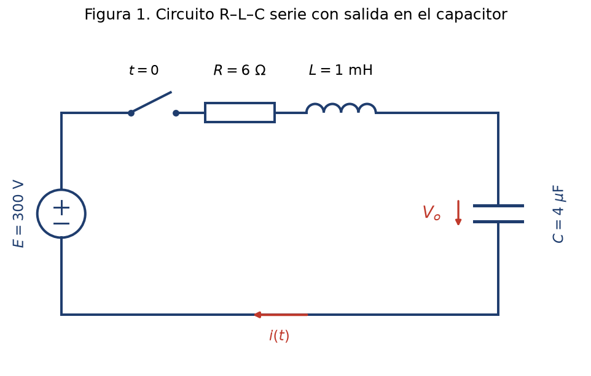
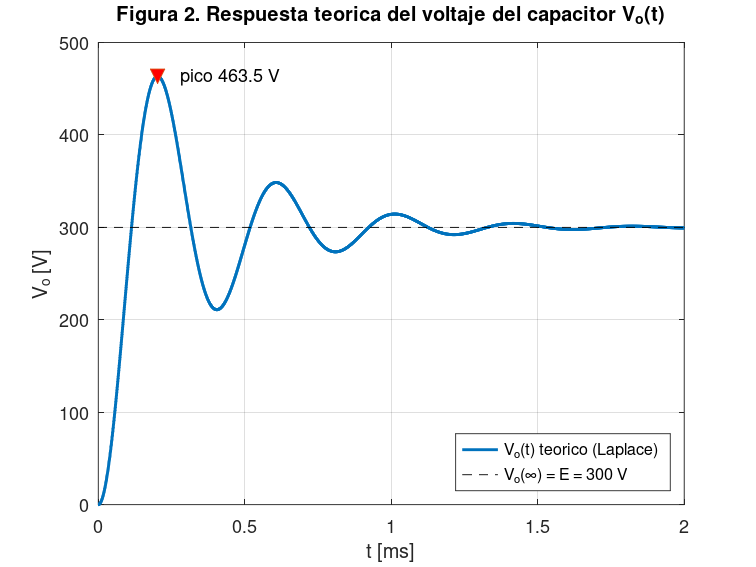
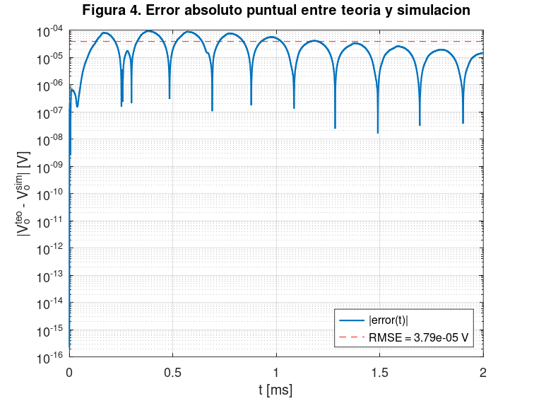

<!--
DOCUMENTO DE CONTENIDO DEL PROY (Proyecto Final) - Proyecto 2 v2 (Laplace).
Contiene TODO el contenido pedido por la consigna EXCEPTO el formato de Word
(Arial 12, interlineado 1.5, numeracion de paginas, indice con paginas).
El formato se aplica con "Prompt Word (formato).md" (md_to_docx.py + add-in de Claude).
Cubre los 7 criterios de la rubrica del PROY (20 pts), incluida la discusion
con el error y las conclusiones. El enlace del video se pega en la portada
antes de exportar.
-->

# Determinación del voltaje de un capacitor en un circuito R–L–C serie mediante la Transformada de Laplace y su simulación en GNU Octave

**Proyecto Final (PROY) — Series y Transformadas**
UTP · Ciclo 2026-1 · Docente: J. F. Torres
Modalidad: individual
Integrante: Tito Luyo Murata
**Enlace del video:** _(pegar aquí antes de exportar)_
Julio de 2026

---

## Contenido

1. Introducción
2. Marco teórico
   - 2.1. Transformada de Laplace: definición
   - 2.2. Propiedades utilizadas
   - 2.3. Modelo del circuito R–L–C serie (ecuaciones aplicadas)
   - 2.4. El simulador: GNU Octave
3. Desarrollo — solución teórica
   - 3.1. Definición del circuito
   - 3.2. Planteamiento de la ecuación
   - 3.3. Aplicación de la Transformada de Laplace
   - 3.4. Fracciones parciales
   - 3.5. Completación de cuadrados y antitransformada
   - 3.6. Voltaje del capacitor y corriente
   - 3.7. Resultados y análisis teórico
4. Desarrollo — solución por simulación
   - 4.1. Desarrollo del programa
   - 4.2. Resultados de la simulación
   - 4.3. Análisis de los resultados del simulador
5. Discusión y conclusiones
   - 5.1. Comparación teórico vs. simulado (con el error)
   - 5.2. Conclusión sobre los resultados teóricos
   - 5.3. Conclusión sobre los resultados simulados
   - 5.4. Conclusión de la discusión (con el error)
6. Referencias bibliográficas
Anexo A. Código de Octave

> **Lista de figuras.** Figura 1: circuito R–L–C serie con salida en el capacitor. Figura 2: respuesta teórica del voltaje del capacitor $V_o(t)$. Figura 3: comparación de $V_o(t)$ teórico vs. simulado. Figura 4: error absoluto puntual entre teoría y simulación.
>
> **Lista de tablas.** Tabla 1: parámetros del circuito. Tabla 2: voltaje del capacitor en instantes representativos, teórico vs. simulado, con el error.

---

## 1. Introducción

El análisis de **transitorios** es una tarea central de la ingeniería electrónica. Cuando un interruptor conecta una fuente a un circuito, las tensiones y corrientes no alcanzan de inmediato su valor final: evolucionan durante un intervalo gobernado por los elementos capaces de almacenar energía —inductores y capacitores— (Alexander & Sadiku, 2013). Predecir esa evolución con exactitud permite dimensionar los componentes, anticipar sobretensiones que podrían dañarlos y garantizar que el sistema se estabilice dentro de márgenes seguros.

Un circuito **R–L–C serie** alimentado por una fuente tipo escalón es el caso canónico de este análisis: su comportamiento queda descrito por una **ecuación diferencial ordinaria de segundo orden** con condiciones iniciales. Resolverla directamente en el dominio del tiempo es laborioso; la **Transformada de Laplace** ofrece en cambio una vía sistemática, pues convierte la ecuación diferencial en una **ecuación algebraica**, incorpora automáticamente las condiciones iniciales y, mediante la transformada inversa, devuelve la solución exacta en el dominio del tiempo (Hsu & Ward, 1991; Zill, 2018).

Como antecedente específico, en la empresa *Electronics S.A.* se necesita **determinar el voltaje de un capacitor** $V_o(t)$ para un circuito específico, apoyándose simultáneamente en la teoría y en un programa de simulación. Para este proyecto se propone como caso concreto un circuito serie R–L–C con valores comerciales típicos de la electrónica de potencia —$R = 6\ \Omega$, $L = 1$ mH, $C = 4\ \mu$F— energizado por un bus de continua de $300$ V, magnitud comparable al pico de la red de 220 V RMS rectificada. La pregunta de ingeniería que articula el proyecto es: **¿cómo evoluciona el voltaje del capacitor tras cerrar el interruptor, qué valor máximo alcanza, y coincide la predicción teórica de Laplace con la que arroja un simulador numérico independiente?**

**Objetivo principal.** Determinar, por vía **analítica** (Transformada de Laplace) y por **simulación en GNU Octave**, el voltaje del capacitor $V_o(t)$ de un circuito R–L–C serie con excitación escalón, comparando ambos resultados mediante el error y extrayendo conclusiones de ingeniería.

**Objetivos específicos.** (1) Plantear la ecuación diferencial del circuito con sus condiciones iniciales mediante la ley de voltajes de Kirchhoff, en función de la carga $q(t)$; (2) resolver $Q(s)$ mediante la Transformada de Laplace, antitransformar por fracciones parciales y completación de cuadrados, y obtener $V_o(t) = q(t)/C$ en forma cerrada; (3) reproducir el circuito numéricamente en GNU Octave por una vía independiente de la solución analítica; (4) comparar ambos resultados cuantificando el error y concluir sobre el comportamiento del circuito.

## 2. Marco teórico

### 2.1. Transformada de Laplace: definición

La **Transformada de Laplace** de una función $F(t)$ definida para $t > 0$ es la integral impropia (Hsu & Ward, 1991):

$$\mathcal{L}\{F(t)\} = \int_0^{\infty} e^{-st}\,F(t)\,dt = f(s)$$

Esta operación lleva una función del **dominio del tiempo** al dominio de la **variable compleja** $s$. Su utilidad central en ingeniería es transformar **ecuaciones diferenciales** en **ecuaciones algebraicas**; una vez despejada la incógnita en $s$, se regresa al tiempo mediante la **transformada inversa** $\mathcal{L}^{-1}$ (Zill, 2018).

### 2.2. Propiedades utilizadas

Para resolver el circuito de este proyecto se emplean las siguientes propiedades (Hsu & Ward, 1991):

**a) Linealidad.** $\;\mathcal{L}\{c_1 F_1(t) + c_2 F_2(t)\} = c_1 f_1(s) + c_2 f_2(s)$.

**b) Transformada de una constante.** $\;\mathcal{L}\{k\} = \dfrac{k}{s}$.

**c) Transformada de las derivadas** (incorpora las condiciones iniciales):

$$\mathcal{L}\{F'(t)\} = s\,f(s) - F(0), \qquad \mathcal{L}\{F''(t)\} = s^2 f(s) - s\,F(0) - F'(0)$$

**d) Primera propiedad de traslación (en $s$)** y sus inversas, que permiten reconocer los términos oscilatorios amortiguados:

$$\mathcal{L}^{-1}\!\left\{\frac{s-b}{(s-b)^2+a^2}\right\} = e^{bt}\cos at, \qquad \mathcal{L}^{-1}\!\left\{\frac{a}{(s-b)^2+a^2}\right\} = e^{bt}\sin at$$

La antitransformación se apoya además en la técnica de **fracciones parciales** combinada con la **completación de cuadrados** del denominador.

### 2.3. Modelo del circuito R–L–C serie (ecuaciones aplicadas)

Por la **ley de voltajes de Kirchhoff**, la suma de las caídas de tensión en la malla iguala la fem aplicada (Alexander & Sadiku, 2013). En un circuito serie R–L–C las caídas son $V_R = R\,I$ en la resistencia, $V_L = L\,dI/dt$ en el inductor y $V_C = q/C$ en el capacitor:

$$L\frac{dI}{dt} + R\,I + \frac{q}{C} = E$$

Como la corriente es la derivada de la carga, $I = dq/dt$, la ecuación queda en función de una sola incógnita $q(t)$:

$$L\,\frac{d^2 q}{dt^2} + R\,\frac{dq}{dt} + \frac{q}{C} = E$$

que es una **ecuación diferencial de segundo orden** con coeficientes constantes. Una vez resuelta la carga, el **voltaje del capacitor** —la magnitud que pide el proyecto— se obtiene directamente como:

$$V_o(t) = \frac{q(t)}{C}$$

### 2.4. El simulador: GNU Octave

**GNU Octave** es un lenguaje interpretado de alto nivel para cálculo numérico, de código abierto y ampliamente compatible con MATLAB (Eaton et al., 2024). Permite definir vectores de tiempo, evaluar funciones elementales, **integrar numéricamente ecuaciones diferenciales** mediante rutinas como `lsode` y graficar señales. Estas capacidades bastan para resolver la EDO del circuito de forma **independiente** de la solución analítica —integrando directamente la ecuación original— y comparar ambas respuestas, razón por la cual se adopta como simulador del proyecto.

## 3. Desarrollo — solución teórica

### 3.1. Definición del circuito

Se analiza un circuito serie **R–L–C** alimentado por una **fuente escalón** de $E = 300$ V (un interruptor que cierra en $t = 0$); la salida de interés es el voltaje del capacitor $V_o = q/C$. Los valores, tomados de la serie comercial estándar de componentes, se resumen en la Tabla 1.

**Tabla 1.** Parámetros del circuito R–L–C serie.

| Parámetro | Símbolo | Valor |
| --------- | ------- | ----- |
| Resistencia | $R$ | $6\ \Omega$ |
| Inductancia | $L$ | $1\ \text{mH}$ |
| Capacitancia | $C$ | $4\ \mu\text{F}$ |
| Fuente (escalón) | $E$ | $300$ V |



Antes de $t = 0$ el interruptor está abierto y el capacitor descargado, de modo que las **condiciones iniciales** son:

$$q(0) = 0, \qquad I(0) = q'(0) = 0$$

### 3.2. Planteamiento de la ecuación

Sustituyendo los valores en el modelo de la sección 2.3:

$$10^{-3}\,q'' + 6\,q' + \frac{q}{4\times10^{-6}} = 300$$

Dividiendo entre $L = 10^{-3}$, con $R/L = 6000$, $1/LC = 2{,}5\times10^{8}$ y $E/L = 3\times10^{5}$:

$$\boxed{\;q'' + 6000\,q' + 2{,}5\times10^{8}\,q = 3\times10^{5}\;}\qquad q(0)=0,\;\; q'(0)=0$$

### 3.3. Aplicación de la Transformada de Laplace

Sea $Q(s) = \mathcal{L}\{q(t)\}$. Aplicando la transformada de las derivadas con condiciones iniciales nulas:

$$s^2 Q(s) + 6000\,s\,Q(s) + 2{,}5\times10^{8}\,Q(s) = \frac{3\times10^{5}}{s}$$

Factorizando y despejando:

$$Q(s) = \frac{3\times10^{5}}{s\,\bigl(s^2 + 6000s + 2{,}5\times10^{8}\bigr)}$$

### 3.4. Fracciones parciales

$$\frac{3\times10^{5}}{s\,(s^2+6000s+2{,}5\times10^{8})} = \frac{A}{s} + \frac{Bs + D}{s^2 + 6000s + 2{,}5\times10^{8}}$$

Multiplicando por el denominador común e igualando coeficientes: en $s=0$ resulta $A = 3\times10^{5}/2{,}5\times10^{8} = 1{,}2\times10^{-3}$; del coeficiente de $s^2$, $B = -A = -1{,}2\times10^{-3}$; y del coeficiente de $s$, $D = -6000A = -7{,}2$:

$$Q(s) = \frac{1{,}2\times10^{-3}}{s} + \frac{-1{,}2\times10^{-3}\,s - 7{,}2}{s^2 + 6000s + 2{,}5\times10^{8}}$$

### 3.5. Completación de cuadrados y antitransformada

El denominador cuadrático no posee raíces reales (discriminante $6000^2 - 4\cdot2{,}5\times10^{8} < 0$), por lo que se completa el cuadrado:

$$s^2 + 6000s + 2{,}5\times10^{8} = (s+3000)^2 + \omega_d^{\,2}, \qquad \omega_d = 1000\sqrt{241} \approx 15\,524{,}2\ \text{rad/s}$$

Reescribiendo el numerador en términos de $(s+3000)$, con $-1{,}2\times10^{-3}s - 7{,}2 = -1{,}2\times10^{-3}(s+3000) - 3{,}6$ y $3{,}6/\omega_d \approx 2{,}319\times10^{-4}$:

$$Q(s) = \frac{1{,}2\times10^{-3}}{s} \;-\; 1{,}2\times10^{-3}\,\frac{s+3000}{(s+3000)^2 + \omega_d^{2}} \;-\; 2{,}319\times10^{-4}\,\frac{\omega_d}{(s+3000)^2 + \omega_d^{2}}$$

Aplicando la transformada inversa término a término con las formas de la sección 2.2(d):

$$q(t) = 1{,}2\times10^{-3} - e^{-3000t}\bigl(1{,}2\times10^{-3}\cos\omega_d t + 2{,}319\times10^{-4}\sin\omega_d t\bigr)\ \text{C}$$

En régimen permanente $q_\infty = 1{,}2$ mC $= C\cdot E$, coherente con un capacitor cargado al valor de la fuente.

### 3.6. Voltaje del capacitor y corriente

Dividiendo la carga entre $C = 4\times10^{-6}$ F se obtiene la magnitud pedida por el proyecto:

$$\boxed{\;V_o(t) = 300 - e^{-3000t}\Bigl(300\cos\omega_d t + \tfrac{900}{\sqrt{241}}\sin\omega_d t\Bigr) \approx 300 - e^{-3000t}\bigl(300\cos\omega_d t + 57{,}97\sin\omega_d t\bigr)\ \text{V}\;}$$

Derivando la carga se obtiene la corriente; los términos en coseno se cancelan y queda:

$$I(t) = q'(t) = \frac{300}{\sqrt{241}}\,e^{-3000t}\sin\omega_d t \approx 19{,}32\,e^{-3000t}\sin\omega_d t\ \text{A}$$

La solución satisface las condiciones físicas del circuito, lo que sirve de autocomprobación: $V_o(0) = 300 - 300 = 0$ V (capacitor inicialmente descargado), $I(0) = 0$ A (corriente inicial nula) y $V_o(\infty) = 300$ V (el término $e^{-3000t}$ se extingue y el capacitor queda cargado al valor de la fuente).

### 3.7. Resultados y análisis teórico

La ecuación característica $s^2 + 6000s + 2{,}5\times10^{8} = 0$ tiene **polos complejos conjugados** $s = -3000 \pm j\,1000\sqrt{241}$, de modo que la respuesta es un **transitorio oscilatorio amortiguado**: la envolvente $e^{-3000t}$ (constante de tiempo $\approx 0{,}33$ ms) extingue la oscilación de frecuencia $\omega_d \approx 15\,524$ rad/s ($f_d \approx 2{,}47$ kHz, período $\approx 0{,}40$ ms) en aproximadamente $1{,}3$ ms.

El **valor máximo** del voltaje se obtiene evaluando la solución en el primer semiciclo de la oscilación, $\omega_d t = \pi$ (allí $\sin = 0$ y $\cos = -1$), es decir en $t_p = \pi/\omega_d \approx 0{,}202$ ms:

$$V_o(t_p) = 300\bigl(1 + e^{-3\pi/\sqrt{241}}\bigr) \approx 463{,}5\ \text{V}$$

Es decir, el capacitor **sobrepasa la fuente en un $54{,}5\ \%$** antes de estabilizarse. La Figura 2 grafica la respuesta teórica completa: el voltaje crece desde cero, alcanza el pico de $463{,}5$ V en $0{,}202$ ms y oscila con amplitud decreciente alrededor de los $300$ V finales.



## 4. Desarrollo — solución por simulación

### 4.1. Desarrollo del programa

Se implementó el script `proyecto2v2_laplace.m` en GNU Octave (código completo en el **Anexo A**). El programa **no utiliza la fórmula cerrada** de la sección 3: reescribe la ecuación diferencial original como un sistema de primer orden en el estado $x = [q,\ q']^\top$ y lo integra numéricamente con la rutina `lsode`, partiendo de las condiciones iniciales nulas. Esto convierte a la simulación en una **vía independiente** de la solución analítica, de modo que ambos resultados pueden contrastarse legítimamente. El núcleo del programa es:

```octave
% Parametros del circuito
R = 6; L = 1e-3; C = 4e-6; E = 300;
a1 = R/L;  a0 = 1/(L*C);  u = E/L;        % 6000, 2.5e8, 3e5

% Simulacion: EDO integrada numericamente (via independiente)
% Estado x = [q; q'] ;  x1' = x2 ;  x2' = u - a1*x2 - a0*x1
f_rlc = @(x, t) [ x(2); u - a1*x(2) - a0*x(1) ];
t = linspace(0, 2e-3, 4001)';             % 0 a 2 ms, paso 0.5 us
X = lsode(f_rlc, [0; 0], t);              % CI: q(0)=0, q'(0)=0
Vo_sim = X(:,1) / C;                      % voltaje del capacitor simulado
```

La malla temporal cubre $t \in [0,\ 2\ \text{ms}]$ con 4001 puntos ($\Delta t = 0{,}5\ \mu$s): unas seis constantes de tiempo del transitorio y alrededor de 31 puntos por período de la oscilación, resolución suficiente para capturar fielmente el pico.

### 4.2. Resultados de la simulación

La Figura 3 superpone el voltaje del capacitor simulado (marcadores) sobre la curva teórica (línea continua). Ambas trayectorias se solapan por completo durante todo el intervalo: el simulador reproduce el crecimiento inicial, el pico cercano a $463$ V, la oscilación amortiguada a $\approx 2{,}47$ kHz y la estabilización en $300$ V.


La Figura 4 muestra el error absoluto puntual entre ambas curvas en escala logarítmica.



### 4.3. Análisis de los resultados del simulador

La integración numérica reproduce fielmente la dinámica prevista: el error absoluto se mantiene **por debajo de $10^{-4}$ V** en todo el intervalo —frente a señales de cientos de voltios—, con un RMSE de $3{,}79\times10^{-5}$ V. El integrador captura correctamente tanto la fase de crecimiento rápido (el voltaje pasa de 0 a más de 450 V en apenas 0,2 ms) como las oscilaciones posteriores y el régimen permanente. Esta concordancia confirma que el modelo del circuito quedó bien planteado y que la resolución temporal elegida es adecuada.

## 5. Discusión y conclusiones

### 5.1. Comparación teórico vs. simulado (con el error)

La Tabla 2 confronta el voltaje del capacitor obtenido por la fórmula cerrada de Laplace y por la integración numérica en instantes representativos del transitorio (incluido el pico $t_p$ y el entorno del tiempo de estabilización).

**Tabla 2.** Voltaje del capacitor en instantes representativos: teórico vs. simulado, con el error.

| $t$ [ms] | $V_o$ teórico [V] | $V_o$ simulado [V] | $\lvert\text{error}\rvert$ [V] | Error rel. [%] |
| -------- | ----------------- | ------------------ | ------------------------------ | -------------- |
| $0{,}1000$ | $252{,}9746$ | $252{,}9746$ | $1{,}71\times10^{-5}$ | $0{,}000006$ |
| $0{,}2025$ ($t_p$) | $463{,}4778$ | $463{,}4777$ | $5{,}86\times10^{-5}$ | $0{,}000020$ |
| $0{,}3000$ | $330{,}2563$ | $330{,}2563$ | $2{,}12\times10^{-7}$ | $0{,}000000$ |
| $0{,}5000$ | $280{,}9761$ | $280{,}9761$ | $1{,}97\times10^{-5}$ | $0{,}000007$ |
| $0{,}8000$ | $273{,}8488$ | $273{,}8488$ | $6{,}85\times10^{-5}$ | $0{,}000023$ |
| $1{,}0000$ | $314{,}1571$ | $314{,}1570$ | $5{,}02\times10^{-5}$ | $0{,}000017$ |
| $1{,}3100$ | $298{,}3726$ | $298{,}3726$ | $1{,}26\times10^{-5}$ | $0{,}000004$ |
| $2{,}0000$ | $299{,}3577$ | $299{,}3577$ | $1{,}45\times10^{-5}$ | $0{,}000005$ |

El error cuadrático medio global es $\text{RMSE} = 3{,}79\times10^{-5}$ V y el error máximo puntual $9{,}19\times10^{-5}$ V: la diferencia relativa entre ambos métodos es **inferior a $10^{-4}\ \%$** en todo el rango analizado. El pequeño residuo se explica por la tolerancia del integrador numérico y crece levemente en las zonas de mayor pendiente de la señal, donde la cuadratura exige más de la resolución temporal; con el paso empleado resulta despreciable.

### 5.2. Conclusión sobre los resultados teóricos

La Transformada de Laplace permitió obtener el voltaje del capacitor en **forma cerrada**: $V_o(t) = 300 - e^{-3000t}(300\cos\omega_d t + 57{,}97\sin\omega_d t)$ V, con $\omega_d = 1000\sqrt{241}$ rad/s. El resultado es físicamente consistente —parte de 0 V, termina en los 300 V de la fuente, con corriente inicial nula— y revela que los polos complejos $-3000 \pm j\,15\,524$ producen un transitorio oscilatorio amortiguado de unos 1,3 ms de duración. El hallazgo de ingeniería central es el **pico de $463{,}5$ V** ($54{,}5\ \%$ por encima de la fuente) en apenas $0{,}202$ ms: en la práctica, los componentes de este circuito deben especificarse para tensiones muy superiores a la nominal del bus (un capacitor de al menos 500–630 V), pues de lo contrario el propio transitorio de conexión los destruiría.

### 5.3. Conclusión sobre los resultados simulados

La simulación en GNU Octave, construida como **vía independiente** —integra la ecuación diferencial original con `lsode` sin conocer la fórmula cerrada—, reproduce la totalidad de la dinámica: crecimiento, pico de $463{,}48$ V en $0{,}202$ ms, oscilación a $2{,}47$ kHz y estabilización en $300$ V. Que un método puramente numérico llegue exactamente a la misma respuesta partiendo solo de la EDO y las condiciones iniciales confirma la corrección del planteamiento del modelo (ley de Kirchhoff, sección 3.2) y la idoneidad de Octave como herramienta de verificación.

### 5.4. Conclusión de la discusión (con el error)

Los dos métodos —el analítico por Transformada de Laplace y el numérico por integración directa— arrojan el mismo voltaje del capacitor con una diferencia relativa menor a $10^{-4}\ \%$ (RMSE $= 3{,}79\times10^{-5}$ V sobre señales de cientos de voltios). Esta doble verificación por caminos independientes valida simultáneamente la solución teórica deducida a mano y la implementación del simulador, y cumple el objetivo principal del proyecto: **determinar $V_o(t)$ del circuito específico por teoría y por simulación, demostrando la equivalencia de ambas vías mediante el error**. Queda demostrado, además, el valor práctico del análisis: solo con la solución en la mano puede anticiparse que un bus de 300 V somete al capacitor a picos de 463 V, información imprescindible para la selección segura de componentes.

## 6. Referencias bibliográficas

Alexander, C. K., & Sadiku, M. N. O. (2013). *Fundamentos de circuitos eléctricos* (5.ª ed.). McGraw-Hill.

Eaton, J. W., Bateman, D., Hauberg, S., & Wehbring, R. (2024). *GNU Octave: A high-level interactive language for numerical computations*. https://octave.org/doc/

Hsu, H. P., & Ward, J. (1991). *Transformada de Laplace*. McGraw-Hill / Interamericana de México.

Zill, D. G. (2018). *Ecuaciones diferenciales con aplicaciones de modelado* (11.ª ed.). Cengage Learning.

> [!warning] Verificar antes de la entrega
> Confirmar los datos exactos de edición/año de Hsu & Ward, Zill y Alexander & Sadiku en la copia consultada antes de exportar. No añadir fuentes que no se hayan revisado.

## Anexo A — Código de Octave

Script completo `proyecto2v2_laplace.m` (reproduce las Figuras 2–4 y la Tabla 2):

```octave
% proyecto2v2_laplace.m — Voltaje del capacitor V_o(t) en un R-L-C serie
% Teoria (Laplace, forma cerrada) vs. simulacion (lsode). CI nulas.
clear all; close all; clc;

% 1. Parametros del circuito
R = 6; L = 1e-3; C = 4e-6; E = 300;
a1 = R/L;  a0 = 1/(L*C);  u = E/L;        % 6000, 2.5e8, 3e5
alpha = a1/2;  wd = sqrt(a0 - alpha^2);   % 3000, 1000*sqrt(241)

% 2. Solucion teorica cerrada (por Laplace)
kc = E;  ks = 900/sqrt(241);
Vo_teo = @(t) E - exp(-alpha*t).*(kc*cos(wd*t) + ks*sin(wd*t));

% 3. Simulacion: EDO numerica (via independiente)
f_rlc = @(x, t) [ x(2); u - a1*x(2) - a0*x(1) ];
t = linspace(0, 2e-3, 4001)';
X = lsode(f_rlc, [0; 0], t);
Vo_sim = X(:,1) / C;

% 4. Error simulado vs. teorico
vt = Vo_teo(t);
err_abs = abs(vt - Vo_sim);
rmse = sqrt(mean((vt - Vo_sim).^2));
printf("RMSE = %.4e V | max|err| = %.4e V\n", rmse, max(err_abs));

tp = pi/wd;
inst = [0.1e-3 tp 0.3e-3 0.5e-3 0.8e-3 1.0e-3 1.31e-3 2.0e-3];
for ti = inst
  [~, k] = min(abs(t - ti));
  printf("%8.4f ms | %11.4f | %11.4f | %.4e\n", ...
         t(k)*1e3, vt(k), Vo_sim(k), err_abs(k));
end

% 5. Figuras (ejes en ms) — respuesta teorica, comparacion y error
tms = t*1e3;
figure(2); plot(tms, vt); hold on; plot([0 2],[E E],'--k');
grid on; xlabel('t [ms]'); ylabel('V_o [V]');
print -dpng -r130 attachments/fig2_vo_teorico.png

figure(3); plot(tms, vt, '-'); hold on;
plot(tms(1:80:end), Vo_sim(1:80:end), 'ro');
grid on; xlabel('t [ms]'); ylabel('V_o [V]');
print -dpng -r130 attachments/fig3_comparacion.png

figure(4); semilogy(tms, err_abs + eps); hold on;
semilogy([0 2], [rmse rmse], '--r');
grid on; xlabel('t [ms]'); ylabel('|error| [V]');
print -dpng -r130 attachments/fig4_error.png
```
