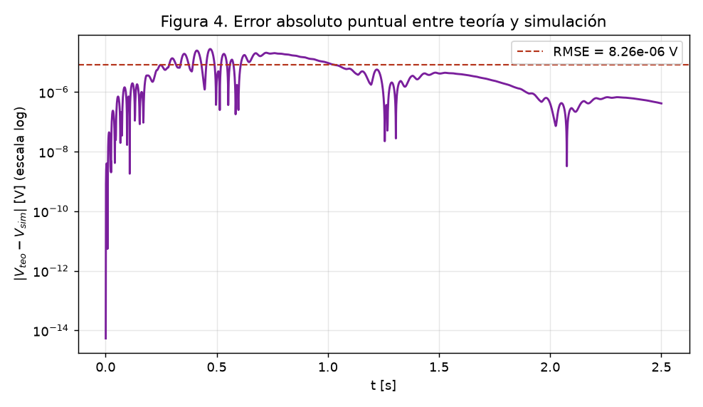

<!--
DOCUMENTO PARA EXPORTAR A PDF (Proyecto 2 - PROY / APF).
Exportar con:  uv run --with pypandoc python utils/md_to_docx.py "cursos/2026-1/SeriesTransformadas/TrabajoFinal/Proyecto2/05 - Documento final.md"
El .docx sale con Arial 12 / interlineado 1.5 (plantilla reference-apa7.docx). Verificar 10-20 paginas.
Las imagenes usan ruta estandar attachments/... para que pandoc las incruste (--resource-path = carpeta de la nota).
-->

# Determinación del voltaje de un capacitor en un circuito RLC serie mediante la Transformada de Laplace y su simulación en GNU Octave

**Curso:** Series y Transformadas — UTP, ciclo 2026-1
**Docente:** J. F. Torres
**Modalidad:** _(individual / grupal — completar)_
**Integrante(s):** _(nombres y códigos)_
**Fecha:** julio de 2026

---

> [!note] Lista de figuras y tablas
> **Figuras:** Fig. 1 circuito RLC serie · Fig. 2 respuesta teórica $V_o(t)$ · Fig. 3 comparación teórico vs. simulado · Fig. 4 error absoluto puntual.
> **Tablas:** Tabla 1 parámetros del circuito · Tabla 2 parámetros del sistema de segundo orden · Tabla 3 comparación $V_o$ teórico vs. simulado con el error.

## 1. Introducción

El análisis de **transitorios** en circuitos eléctricos es una tarea básica de la ingeniería: cuando se conecta o desconecta una fuente, las tensiones y corrientes no saltan de inmediato a su valor final, sino que evolucionan en el tiempo gobernadas por los elementos que almacenan energía —inductores y capacitores— (Alexander & Sadiku, 2013). Predecir esa evolución permite dimensionar componentes, evitar sobretensiones y garantizar que un sistema se estabilice dentro de márgenes seguros.

Un circuito **RLC serie** alimentado por una fuente escalón es el caso canónico de este tipo de análisis: su comportamiento queda descrito por una **ecuación diferencial ordinaria de segundo orden** con condiciones iniciales. Resolver esa ecuación en el dominio del tiempo es engorroso; la **Transformada de Laplace** ofrece una vía sistemática que convierte la ecuación diferencial en una **ecuación algebraica**, incorpora automáticamente las condiciones iniciales y, tras una antitransformación, devuelve la solución temporal (Hsu & Ward, 1991; Zill, 2018).

En el marco de la empresa *Electronics S.A.*, que necesita **determinar el voltaje de un capacitor** $V_o(t)$ en un circuito específico, surge la pregunta de ingeniería que motiva este trabajo: **¿cómo evoluciona en el tiempo el voltaje del capacitor tras cerrar el interruptor, y coincide la predicción teórica con lo que arroja un simulador?**

**Objetivo principal.** Determinar, por vía **analítica** (Transformada de Laplace) y por **simulación en GNU Octave**, el voltaje del capacitor $V_o(t)$ de un circuito RLC serie con excitación escalón, y **comparar ambos resultados mediante el error**, verificando que teoría y simulación coinciden.

**Objetivos específicos.** (1) Plantear la ecuación diferencial del circuito con sus condiciones iniciales mediante la ley de voltajes de Kirchhoff; (2) resolver $V_o(s)$ por Laplace, antitransformar por fracciones parciales y obtener $V_o(t)$ en forma cerrada; (3) simular numéricamente el mismo circuito en Octave y comparar teoría y simulación punto a punto, cuantificando el error.

## 2. Marco teórico

### 2.1. Transformada de Laplace

La **Transformada de Laplace** de una función $F(t)$ definida para $t>0$ se define como (Hsu & Ward, 1991):

$$\mathcal{L}\{F(t)\} = \int_0^{\infty} e^{-st}\,F(t)\,dt = f(s)$$

y convierte una función del dominio del tiempo en una función de la variable compleja $s$. Su utilidad para la ingeniería es transformar **ecuaciones diferenciales** en **ecuaciones algebraicas**, resolverlas en el dominio de $s$ y regresar al tiempo con la **transformada inversa** $\mathcal{L}^{-1}$.

### 2.2. Propiedades utilizadas

Para resolver el circuito se emplean las siguientes propiedades (Hsu & Ward, 1991; Zill, 2018):

- **Linealidad:** $\mathcal{L}\{c_1 F_1 + c_2 F_2\} = c_1 f_1(s) + c_2 f_2(s)$.
- **Transformada de las derivadas** (clave para incorporar las condiciones iniciales):
$$\mathcal{L}\{F'(t)\} = s f(s) - F(0), \qquad \mathcal{L}\{F''(t)\} = s^2 f(s) - s F(0) - F'(0)$$
- **Transformada de una constante:** $\mathcal{L}\{k\} = k/s$.
- **Primera propiedad de traslación (en $s$):** $\mathcal{L}^{-1}\{f(s-a)\} = e^{at}F(t)$, que junto con la tabla elemental da las antitransformadas $\frac{s-b}{(s-b)^2+a^2}\to e^{bt}\cos at$ y $\frac{a}{(s-b)^2+a^2}\to e^{bt}\sin at$.

La antitransformación se apoya en **fracciones parciales** y **completación de cuadrados** para reescribir $f(s)$ como combinación de formas de la tabla.

### 2.3. Modelo del circuito RLC serie

En un circuito RLC serie, la **ley de voltajes de Kirchhoff** establece que la suma de las caídas de tensión en el inductor, la resistencia y el capacitor iguala la fem aplicada (Alexander & Sadiku, 2013):

$$L\frac{di}{dt} + R\,i + v_C = E$$

Como la corriente carga el capacitor, $i = C\,dv_C/dt$, la ecuación se escribe en función del voltaje del capacitor $v_C = V_o$:

$$LC\,v_C'' + RC\,v_C' + v_C = E$$

Esta es una EDO de **segundo orden**. Comparada con la forma canónica $v_C'' + 2\zeta\omega_0 v_C' + \omega_0^2 v_C = \omega_0^2 E$, define la **frecuencia natural** $\omega_0 = 1/\sqrt{LC}$ y el **factor de amortiguamiento** $\zeta = \frac{R}{2}\sqrt{C/L}$. Según $\zeta$, la respuesta es sobreamortiguada ($\zeta>1$), críticamente amortiguada ($\zeta=1$) o **subamortiguada** ($\zeta<1$), esta última con **sobreimpulso** y oscilación (Nilsson & Riedel, 2015).

### 2.4. El simulador: GNU Octave

**GNU Octave** es un lenguaje interpretado de alto nivel para cálculo numérico, de código abierto y ampliamente compatible con MATLAB (Eaton et al., 2024). Permite definir vectores de tiempo, evaluar funciones elementales, **integrar numéricamente ecuaciones diferenciales** (`lsode`) y **graficar** señales (`plot`, `semilogy`). Estas capacidades bastan para resolver la EDO del circuito de forma independiente a la solución analítica y cuantificar el error, por lo que se emplea como simulador en este proyecto.

## 3. Desarrollo — solución teórica

### 3.1. Definición del circuito

Se analiza un circuito RLC serie con **fuente escalón** de $E = 100$ V (interruptor que cierra en $t=0$); la salida es el voltaje del capacitor $V_o = v_C$. Los valores producen coeficientes limpios: $R/L = 6$ y $1/LC = 25$.

**Tabla 1.** Parámetros del circuito.

| Parámetro | Símbolo | Valor |
| --------- | ------- | ----- |
| Inductancia | $L$ | $1$ H |
| Resistencia | $R$ | $6\ \Omega$ |
| Capacitancia | $C$ | $0{,}04$ F |
| Fuente (escalón) | $E$ | $100$ V |


Antes de $t=0$ el capacitor está descargado y no circula corriente, de donde las **condiciones iniciales** son $v_C(0)=0$ e $i(0)=0$, esta última equivalente a $v_C'(0)=i(0)/C=0$.

### 3.2. Planteamiento de la ecuación

Aplicando la ley de voltajes de Kirchhoff y $i=C\,v_C'$, y dividiendo entre $LC$:

$$\boxed{\;v_C'' + 6\,v_C' + 25\,v_C = 2500\;}\qquad v_C(0)=0,\;\; v_C'(0)=0$$

donde $2500 = E/(LC)$.

### 3.3. Aplicación de la Transformada de Laplace

Con la transformada de las derivadas y condiciones iniciales nulas, $\mathcal{L}\{v_C\} = V_o(s)$ cumple:

$$(s^2 + 6s + 25)\,V_o(s) = \frac{2500}{s} \qquad\Longrightarrow\qquad V_o(s) = \frac{2500}{s\,(s^2 + 6s + 25)}$$

### 3.4. Fracciones parciales y completación de cuadrados

Descomponiendo $V_o(s) = \dfrac{A}{s} + \dfrac{Bs+C}{s^2+6s+25}$ e igualando coeficientes se obtiene $A=100$, $B=-100$, $C=-600$. El denominador cuadrático no tiene raíces reales, y se completa el cuadrado como $(s+3)^2 + 4^2$. Reescribiendo el numerador en términos de $(s+3)$:

$$V_o(s) = \frac{100}{s} - 100\cdot\frac{s+3}{(s+3)^2 + 4^2} - 75\cdot\frac{4}{(s+3)^2 + 4^2}$$

### 3.5. Antitransformada — voltaje del capacitor

Aplicando $\mathcal{L}^{-1}$ término a término:

$$\boxed{\;V_o(t) = 100 - 100\,e^{-3t}\cos 4t - 75\,e^{-3t}\sin 4t = 100\left[1 - e^{-3t}\!\left(\cos 4t + \tfrac{3}{4}\sin 4t\right)\right]\ \text{V}\;}$$

El desarrollo paso a paso, con la deducción de cada coeficiente, se recoge en el desarrollo analítico de la Etapa B. Las **autocomprobaciones** confirman la solución: $V_o(0) = 0$ (capacitor descargado) y $V_o(\infty) = 100$ V (se carga a la fuente).

### 3.6. Análisis del régimen

Los polos $s = -3 \pm 4j$ son complejos conjugados, de modo que la respuesta es **subamortiguada**. La Tabla 2 resume los parámetros del sistema de segundo orden.

**Tabla 2.** Parámetros del sistema de segundo orden.

| Parámetro | Fórmula | Valor |
| --------- | ------- | ----- |
| Frecuencia natural | $\omega_0 = 1/\sqrt{LC}$ | $5$ rad/s |
| Atenuación | $\alpha = R/(2L)$ | $3$ s⁻¹ |
| Factor de amortiguamiento | $\zeta = \alpha/\omega_0$ | $0{,}6$ (subamortiguado) |
| Frecuencia amortiguada | $\omega_d = \omega_0\sqrt{1-\zeta^2}$ | $4$ rad/s |
| Sobreimpulso | $M_p = e^{-\zeta\pi/\sqrt{1-\zeta^2}}$ | $9{,}48\%$ |
| Voltaje pico | $V_p = E(1+M_p)$ | $109{,}48$ V |
| Tiempo de pico | $t_p = \pi/\omega_d$ | $0{,}785$ s |
| Tiempo de establecimiento (2 %) | $t_s \approx 4/\alpha$ | $1{,}33$ s |

La Figura 2 muestra la respuesta teórica: el voltaje sube, **sobrepasa** los 100 V finales hasta $V_p = 109{,}5$ V hacia $t_p = 0{,}785$ s, y luego oscila amortiguadamente a $\omega_d = 4$ rad/s hasta estabilizarse.


## 4. Desarrollo — solución por simulación

Se implementó el script `proyecto2_laplace.m` en GNU Octave (código completo en el **Anexo A**). El programa **no usa la fórmula cerrada**: reescribe la EDO como el sistema de primer orden $x_1' = x_2$, $x_2' = 2500 - 6x_2 - 25x_1$ (con $x_1 = v_C$) y lo integra con `lsode` sobre una malla de $2501$ puntos en $t\in[0,\,2{,}5]$ s. Al ser una **vía independiente**, la comparación con la teoría constituye una verificación cruzada real.

La Figura 3 superpone la curva teórica (Laplace) y la simulada (Octave): ambas se solapan por completo.


La Figura 4 muestra el error absoluto punto a punto en escala semilogarítmica.



El error permanece en el orden de $10^{-6}$–$10^{-5}$ V a lo largo de todo el intervalo, más de siete órdenes de magnitud por debajo de la señal (del orden de $10^2$ V). Los picos hacia abajo son cruces por cero donde ambas curvas coinciden exactamente.

## 5. Discusión y conclusiones

### 5.1. Comparación teórico vs. simulado (con el error)

La Tabla 3 confronta el voltaje del capacitor obtenido por la solución analítica de Laplace y por integración numérica en Octave, en instantes representativos.

**Tabla 3.** Voltaje del capacitor: teórico vs. simulado, con el error.

| $t$ [s] | $V_o$ teórico [V] | $V_o$ simulado [V] | $\lvert\text{error}\rvert$ [V] |
| ------- | ----------------- | ------------------ | ------------------------------ |
| $0{,}200$ | $32{,}2369$ | $32{,}2369$ | $3{,}1\times10^{-6}$ |
| $0{,}400$ | $78{,}2995$ | $78{,}2995$ | $1{,}7\times10^{-5}$ |
| $0{,}600$ | $103{,}8150$ | $103{,}8150$ | $1{,}5\times10^{-6}$ |
| $0{,}785$ ($t_p$) | $109{,}4780$ | $109{,}4780$ | $1{,}9\times10^{-5}$ |
| $1{,}000$ | $106{,}0802$ | $106{,}0802$ | $9{,}4\times10^{-6}$ |
| $1{,}333$ ($t_s$) | $100{,}0547$ | $100{,}0547$ | $2{,}1\times10^{-6}$ |
| $2{,}000$ | $99{,}8521$ | $99{,}8521$ | $4{,}0\times10^{-7}$ |
| $2{,}500$ | $100{,}0690$ | $100{,}0690$ | $4{,}1\times10^{-7}$ |

El error cuadrático medio global es $\text{RMSE} = 8{,}26\times10^{-6}$ V y el máximo $2{,}74\times10^{-5}$ V: una coincidencia del orden de $10^{-6}\%$ relativa a la señal. El pequeño residuo proviene únicamente de la tolerancia del integrador `lsode`, no de un desajuste del modelo.

### 5.2. Conclusión sobre los resultados teóricos

La Transformada de Laplace permitió obtener el voltaje del capacitor en forma cerrada, $V_o(t) = 100\left[1 - e^{-3t}(\cos 4t + \tfrac34\sin 4t)\right]$ V, de manera sistemática: la EDO de segundo orden se transformó en una ecuación algebraica, se resolvió por fracciones parciales y se antitransformó término a término. El resultado es consistente con la física del circuito —parte de $0$ V y tiende a los $100$ V de la fuente— y las autocomprobaciones de las condiciones iniciales se cumplen exactamente. El sistema es **subamortiguado** ($\zeta = 0{,}6$), con un sobreimpulso del $9{,}5\%$ y estabilización en ≈ $1{,}33$ s.

### 5.3. Conclusión sobre los resultados simulados

La integración numérica de la EDO en Octave reproduce el mismo voltaje del capacitor sin recurrir a la solución analítica. La simulación captura fielmente el sobreimpulso a $109{,}5$ V y la oscilación amortiguada a $4$ rad/s, confirmando visual y numéricamente el régimen subamortiguado previsto por los polos $-3 \pm 4j$.

### 5.4. Conclusión de la discusión (con el error)

Los dos métodos —analítico (Laplace) y numérico (`lsode`)— arrojan el mismo $V_o(t)$ con un RMSE de apenas $8{,}3\times10^{-6}$ V, esto es, una diferencia relativa del orden de $10^{-6}\%$. Esta doble verificación, por caminos **independientes**, valida simultáneamente la corrección de la solución deducida a mano y del modelo implementado en el simulador. Se cumple así el objetivo principal del proyecto: determinar el voltaje del capacitor por teoría y por simulación, y demostrar su equivalencia mediante el error.

## 6. Referencias

Alexander, C. K., & Sadiku, M. N. O. (2013). *Fundamentos de circuitos eléctricos* (5.ª ed.). McGraw-Hill.

Eaton, J. W., Bateman, D., Hauberg, S., & Wehbring, R. (2024). *GNU Octave: A high-level interactive language for numerical computations*. https://octave.org/doc/

Hsu, H. P., & Ward, J. (1991). *Transformada de Laplace*. McGraw-Hill / Interamericana de México.

Nilsson, J. W., & Riedel, S. A. (2015). *Circuitos eléctricos* (10.ª ed.). Pearson.

Zill, D. G. (2018). *Ecuaciones diferenciales con aplicaciones de modelado* (11.ª ed.). Cengage Learning.

> [!warning] Verificar antes de la entrega
> Confirmar los datos exactos de edición/año de Hsu & Ward, Zill, Alexander & Sadiku y Nilsson & Riedel en la copia consultada (biblioteca UTP) antes de imprimir. No añadir fuentes que no se hayan revisado. Ver [[Proyecto2/Fuentes (APA)|Fuentes]] y [[01 - Busqueda de fuentes (APA)]].

## Anexo A — Código de Octave

Script completo: [`proyecto2_laplace.m`](proyecto2_laplace.m). Resuelve la EDO con `lsode`, reproduce las figuras y la tabla de errores.

```octave
L=1; R=6; C=0.04; E=100;
a1=R/L; a0=1/(L*C); u=E/(L*C);           % 6, 25, 2500
Vo_teo = @(t) E - 100*exp(-3*t).*cos(4*t) - 75*exp(-3*t).*sin(4*t);
function xdot = rlc(x,t)
  global A1 A0 U
  xdot = [ x(2);  U - A1*x(2) - A0*x(1) ];
end
t = linspace(0,2.5,2501)';
X = lsode(@rlc, [0;0], t);   Vo_sim = X(:,1);
rmse = sqrt(mean((Vo_teo(t)-Vo_sim).^2));
% ... figuras y tabla de error (ver archivo .m completo)
```
