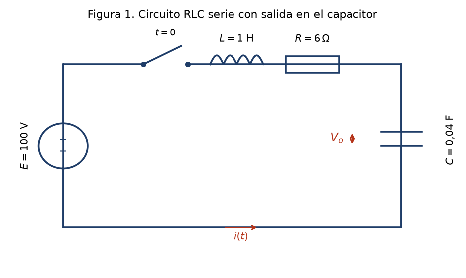
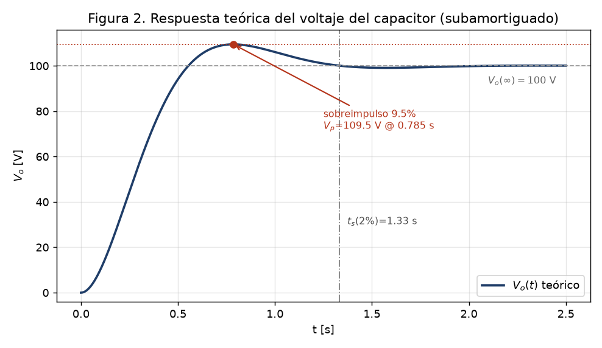
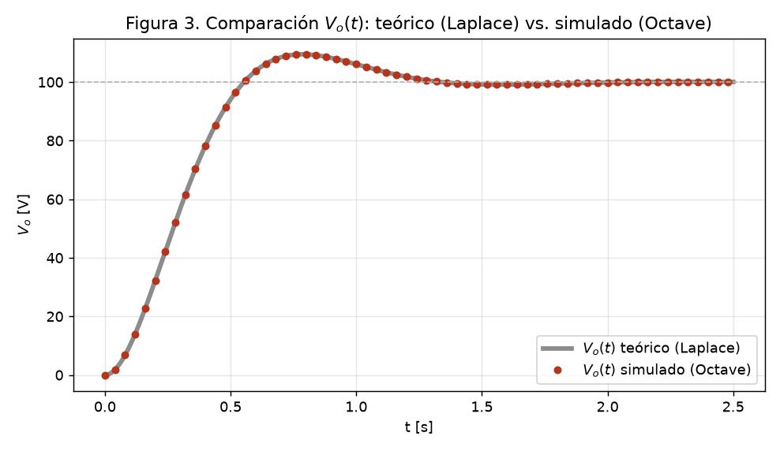

<!--
DOCUMENTO DE CONTENIDO DEL APF (Avance de Proyecto Final) — SOLO Transformada de Laplace.
Este .md contiene TODO el contenido pedido por la consigna EXCEPTO el formato de Word
(fuente Arial 12, interlineado 1.5, numeracion de paginas, indice con numeros de pagina).
El formato se aplica con el prompt: "APF - Prompt Word (formato).md" usando el add-in de Claude en Word.
Alcance APF = Introduccion + Marco teorico + Dominio teorico + Dominio de simulacion + Referencias.
NO incluye discusion del error, conclusiones ni video (eso corresponde al PROY / Proyecto Final).
-->

# Determinación del voltaje de un capacitor en un circuito RLC serie mediante la Transformada de Laplace y su simulación en GNU Octave

**Curso:** Series y Transformadas — UTP, ciclo 2026-1
**Docente:** J. F. Torres
**Modalidad:** _(individual / grupal — completar)_
**Integrante(s):** _(nombres y códigos)_
**Fecha:** julio de 2026

---

## Índice

> [!note] Nota sobre el índice
> Se lista la estructura del documento y las figuras/tablas. **Los números de página se generan automáticamente al maquetar en Word** (ver el prompt de formato); aquí no se colocan porque dependen de la paginación final.

1. Introducción
2. Marco teórico
   - 2.1. Transformada de Laplace: definición
   - 2.2. Propiedades utilizadas
   - 2.3. Modelo del circuito RLC serie (ecuaciones aplicadas)
   - 2.4. El simulador: GNU Octave
3. Dominio teórico de la Transformada de Laplace
   - 3.1. Definición del circuito
   - 3.2. Planteamiento de la ecuación
   - 3.3. Aplicación de la Transformada de Laplace
   - 3.4. Fracciones parciales y completación de cuadrados
   - 3.5. Antitransformada: voltaje del capacitor
   - 3.6. Resultados y análisis teórico
4. Dominio de simulación de la Transformada de Laplace
   - 4.1. Desarrollo del programa
   - 4.2. Resultados de la simulación
   - 4.3. Análisis de los resultados del simulador
5. Referencias bibliográficas

**Lista de figuras**
- Figura 1. Circuito RLC serie con salida en el capacitor.
- Figura 2. Respuesta teórica del voltaje del capacitor $V_o(t)$.
- Figura 3. Comparación de $V_o(t)$: teórico (Laplace) vs. simulado (Octave).

**Lista de tablas**
- Tabla 1. Parámetros del circuito.
- Tabla 2. Parámetros del sistema de segundo orden.
- Tabla 3. Voltaje del capacitor $V_o(t)$ en instantes representativos: teórico y simulado.

---

## 1. Introducción

El análisis de **transitorios** en circuitos eléctricos es una tarea fundamental de la ingeniería electrónica. Cuando se conecta o desconecta una fuente de alimentación, las tensiones y corrientes del circuito no alcanzan de inmediato su valor final, sino que evolucionan en el tiempo gobernadas por los elementos capaces de almacenar energía —inductores y capacitores— (Alexander & Sadiku, 2013). Predecir con exactitud esa evolución permite dimensionar los componentes, prevenir sobretensiones que puedan dañar la carga y garantizar que el sistema se estabilice dentro de márgenes seguros de operación.

Un circuito **RLC serie** alimentado por una fuente de tipo escalón constituye el caso canónico de este tipo de análisis. Su comportamiento queda descrito por una **ecuación diferencial ordinaria de segundo orden** con condiciones iniciales, cuya resolución directa en el dominio del tiempo resulta laboriosa. Frente a ello, la **Transformada de Laplace** ofrece una vía sistemática y elegante: convierte la ecuación diferencial en una **ecuación algebraica**, incorpora automáticamente las condiciones iniciales del circuito y, tras una operación de antitransformación, devuelve la solución en el dominio del tiempo (Hsu & Ward, 1991; Zill, 2018). Esta propiedad hace de la Transformada de Laplace una de las herramientas más empleadas en el análisis de sistemas lineales en ingeniería.

En el marco de la empresa *Electronics S.A.*, que requiere **determinar el voltaje de un capacitor** $V_o(t)$ en un circuito específico apoyándose tanto en la teoría como en una herramienta de simulación, surge la pregunta de ingeniería que motiva este avance: **¿cómo evoluciona en el tiempo el voltaje del capacitor tras cerrar el interruptor, y coincide la predicción teórica obtenida por Laplace con la que arroja un simulador numérico?** Responder a esta pregunta valida, por dos caminos independientes, tanto el modelo matemático del circuito como su implementación computacional.

**Objetivo principal.** Determinar, por vía **analítica** (Transformada de Laplace) y por **simulación en GNU Octave**, el voltaje del capacitor $V_o(t)$ de un circuito RLC serie con excitación escalón, presentando en ambos casos los resultados y su análisis.

**Objetivos específicos.** (1) Plantear la ecuación diferencial del circuito con sus condiciones iniciales mediante la ley de voltajes de Kirchhoff; (2) resolver $V_o(s)$ mediante la Transformada de Laplace, antitransformar por fracciones parciales y obtener $V_o(t)$ en forma cerrada, graficando la respuesta; (3) reproducir numéricamente el mismo circuito en GNU Octave y presentar la respuesta simulada del voltaje del capacitor.

## 2. Marco teórico

### 2.1. Transformada de Laplace: definición

La **Transformada de Laplace** de una función $F(t)$ definida para $t > 0$ se define como la integral impropia (Hsu & Ward, 1991):

$$\mathcal{L}\{F(t)\} = \int_0^{\infty} e^{-st}\,F(t)\,dt = f(s)$$

Esta operación transforma una función del **dominio del tiempo** en una función de la **variable compleja** $s$. Su utilidad central para la ingeniería consiste en transformar **ecuaciones diferenciales** —difíciles de resolver directamente— en **ecuaciones algebraicas** sencillas; una vez resueltas en el dominio de $s$, se regresa al dominio del tiempo mediante la **transformada inversa** $\mathcal{L}^{-1}$ (Zill, 2018).

### 2.2. Propiedades utilizadas

Para resolver el circuito de este proyecto se emplean las siguientes propiedades de la Transformada de Laplace (Hsu & Ward, 1991):

**a) Linealidad.** Para constantes $c_1, c_2$:

$$\mathcal{L}\{c_1 F_1(t) + c_2 F_2(t)\} = c_1 f_1(s) + c_2 f_2(s)$$

**b) Transformada de una constante.** $\;\mathcal{L}\{k\} = \dfrac{k}{s}$.

**c) Transformada de las derivadas** (propiedad clave para incorporar las condiciones iniciales):

$$\mathcal{L}\{F'(t)\} = s\,f(s) - F(0), \qquad \mathcal{L}\{F''(t)\} = s^2 f(s) - s\,F(0) - F'(0)$$

**d) Primera propiedad de traslación (en $s$)** y su inversa, que permiten reconocer las antitransformadas de los términos oscilatorios amortiguados:

$$\mathcal{L}^{-1}\!\left\{\frac{s-b}{(s-b)^2+a^2}\right\} = e^{bt}\cos at, \qquad \mathcal{L}^{-1}\!\left\{\frac{a}{(s-b)^2+a^2}\right\} = e^{bt}\sin at$$

La antitransformación de la solución se apoya, además, en la técnica de **fracciones parciales** combinada con la **completación de cuadrados** del denominador.

### 2.3. Modelo del circuito RLC serie (ecuaciones aplicadas)

En un circuito RLC serie, la **ley de voltajes de Kirchhoff** establece que la suma de las caídas de tensión en el inductor, la resistencia y el capacitor iguala la fem aplicada (Alexander & Sadiku, 2013):

$$L\frac{di}{dt} + R\,i + v_C = E$$

donde $V_L = L\,di/dt$, $V_R = R\,i$ y $V_C = v_C$ son las caídas en el inductor, la resistencia y el capacitor, respectivamente. Como la misma corriente carga el capacitor, se cumple $i = C\,dv_C/dt$; sustituyendo, la ecuación se expresa en función del voltaje del capacitor $v_C = V_o$:

$$LC\,\frac{d^2 v_C}{dt^2} + RC\,\frac{dv_C}{dt} + v_C = E$$

Esta es una **ecuación diferencial de segundo orden**. Comparada con la forma canónica $v_C'' + 2\zeta\omega_0\,v_C' + \omega_0^2\,v_C = \omega_0^2 E$, define la **frecuencia natural** $\omega_0 = 1/\sqrt{LC}$ y el **factor de amortiguamiento** $\zeta = \tfrac{R}{2}\sqrt{C/L}$. Según el valor de $\zeta$, la respuesta del circuito puede ser sobreamortiguada ($\zeta > 1$), críticamente amortiguada ($\zeta = 1$) o **subamortiguada** ($\zeta < 1$), esta última caracterizada por un **sobreimpulso** y una oscilación amortiguada antes de estabilizarse (Nilsson & Riedel, 2015).

### 2.4. El simulador: GNU Octave

**GNU Octave** es un lenguaje interpretado de alto nivel para cálculo numérico, de código abierto y ampliamente compatible con MATLAB (Eaton et al., 2024). Permite definir vectores de tiempo, evaluar funciones elementales, **integrar numéricamente ecuaciones diferenciales** mediante rutinas como `lsode`, y **graficar** señales con funciones como `plot`. Estas capacidades bastan para resolver la ecuación diferencial del circuito de forma **independiente** a la solución analítica —integrando directamente la EDO— y obtener la respuesta del voltaje del capacitor, por lo que se adopta como simulador en este proyecto.

## 3. Dominio teórico de la Transformada de Laplace

### 3.1. Definición del circuito

Se analiza un circuito RLC serie alimentado por una **fuente escalón** de $E = 100$ V (un interruptor que cierra en $t = 0$); la salida de interés es el **voltaje del capacitor** $V_o = v_C$. Los valores de los componentes, elegidos para producir coeficientes limpios ($R/L = 6$ y $1/LC = 25$), se resumen en la Tabla 1.

**Tabla 1.** Parámetros del circuito RLC serie.

| Parámetro | Símbolo | Valor |
| --------- | ------- | ----- |
| Inductancia | $L$ | $1$ H |
| Resistencia | $R$ | $6\ \Omega$ |
| Capacitancia | $C$ | $0{,}04$ F |
| Fuente (escalón) | $E$ | $100$ V |



Antes de $t = 0$ el interruptor está abierto y el capacitor descargado, de modo que las **condiciones iniciales** son $v_C(0) = 0$ e $i(0) = 0$; esta última equivale a $v_C'(0) = i(0)/C = 0$.

### 3.2. Planteamiento de la ecuación

Aplicando la ley de voltajes de Kirchhoff con $i = C\,v_C'$ y dividiendo entre $LC$, con $R/L = 6$, $1/LC = 25$ y $E/LC = 2500$, se obtiene la ecuación diferencial del circuito:

$$\boxed{\;v_C'' + 6\,v_C' + 25\,v_C = 2500\;}\qquad v_C(0) = 0,\;\; v_C'(0) = 0$$

### 3.3. Aplicación de la Transformada de Laplace

Sea $V_o(s) = \mathcal{L}\{v_C(t)\}$. Aplicando la transformada de las derivadas con condiciones iniciales nulas:

$$s^2 V_o(s) + 6s\,V_o(s) + 25\,V_o(s) = \frac{2500}{s}$$

Factorizando y despejando:

$$V_o(s)\,(s^2 + 6s + 25) = \frac{2500}{s} \qquad\Longrightarrow\qquad V_o(s) = \frac{2500}{s\,(s^2 + 6s + 25)}$$

### 3.4. Fracciones parciales y completación de cuadrados

Se descompone $V_o(s)$ en fracciones parciales:

$$\frac{2500}{s\,(s^2+6s+25)} = \frac{A}{s} + \frac{Bs + C}{s^2 + 6s + 25}$$

Multiplicando por el denominador común e igualando coeficientes se obtiene $A = 100$, $B = -100$ y $C = -600$. El denominador cuadrático no posee raíces reales (discriminante $6^2 - 4\cdot 25 = -64 < 0$), por lo que se **completa el cuadrado**:

$$s^2 + 6s + 25 = (s+3)^2 + 4^2$$

Reescribiendo el numerador en términos de $(s+3)$, y usando $-300 = -75\cdot 4$ para formar la transformada del seno:

$$V_o(s) = \frac{100}{s} \;-\; 100\cdot\frac{s+3}{(s+3)^2 + 4^2} \;-\; 75\cdot\frac{4}{(s+3)^2 + 4^2}$$

### 3.5. Antitransformada: voltaje del capacitor

Aplicando la transformada inversa término a término, con $\mathcal{L}^{-1}\{1/s\} = 1$, $\mathcal{L}^{-1}\{(s+3)/[(s+3)^2+4^2]\} = e^{-3t}\cos 4t$ y $\mathcal{L}^{-1}\{4/[(s+3)^2+4^2]\} = e^{-3t}\sin 4t$, se obtiene el voltaje del capacitor:

$$\boxed{\;V_o(t) = 100 - 100\,e^{-3t}\cos 4t - 75\,e^{-3t}\sin 4t = 100\left[\,1 - e^{-3t}\!\left(\cos 4t + \tfrac{3}{4}\sin 4t\right)\right]\ \text{V}\;}$$

### 3.6. Resultados y análisis teórico

La solución obtenida satisface las **condiciones físicas** del circuito, lo que sirve de autocomprobación: $V_o(0) = 100 - 100(1)(1) - 75(1)(0) = 0$ V (capacitor inicialmente descargado) y $V_o(\infty) = 100$ V (el término $e^{-3t}$ se anula y el capacitor se carga al valor de la fuente).

Los polos de la solución son $s = -3 \pm 4j$ (complejos conjugados), de modo que la respuesta es **subamortiguada**. Comparando con la forma canónica de segundo orden se obtienen los parámetros de la Tabla 2.

**Tabla 2.** Parámetros del sistema de segundo orden.

| Parámetro | Fórmula | Valor |
| --------- | ------- | ----- |
| Frecuencia natural | $\omega_0 = 1/\sqrt{LC}$ | $5$ rad/s |
| Atenuación | $\alpha = R/(2L)$ | $3$ s⁻¹ |
| Factor de amortiguamiento | $\zeta = \alpha/\omega_0$ | $0{,}6$ (subamortiguado) |
| Frecuencia amortiguada | $\omega_d = \omega_0\sqrt{1-\zeta^2}$ | $4$ rad/s |
| Sobreimpulso | $M_p = e^{-\zeta\pi/\sqrt{1-\zeta^2}}$ | $9{,}48\%$ |
| Voltaje pico | $V_p = E(1+M_p)$ | $109{,}48$ V |
| Tiempo de pico | $t_p = \pi/\omega_d$ | $0{,}785$ s |
| Tiempo de establecimiento (2 %) | $t_s \approx 4/\alpha$ | $1{,}33$ s |

La Figura 2 grafica la respuesta teórica $V_o(t)$. El voltaje del capacitor crece, **sobrepasa** el valor final de 100 V hasta alcanzar un pico de $V_p = 109{,}5$ V hacia $t_p = 0{,}785$ s (un sobreimpulso del $9{,}5\%$), y luego **oscila** de forma amortiguada a la frecuencia $\omega_d = 4$ rad/s hasta estabilizarse dentro de la banda del $2\%$ tras aproximadamente $1{,}33$ s. Este comportamiento —sobreimpulso seguido de oscilación decreciente— es característico de un sistema **subamortiguado** ($\zeta = 0{,}6 < 1$) y es totalmente coherente con la ubicación de los polos en $-3 \pm 4j$: la parte real $-3$ fija la rapidez del decaimiento exponencial y la parte imaginaria $\pm 4$ fija la frecuencia de la oscilación.



## 4. Dominio de simulación de la Transformada de Laplace

### 4.1. Desarrollo del programa

Se implementó el script `proyecto2_laplace.m` en GNU Octave. El programa **no utiliza la fórmula cerrada** hallada en la sección 3: reescribe la ecuación diferencial del circuito como un sistema de primer orden y lo integra numéricamente con la rutina `lsode`. Esto convierte a la simulación en una **vía independiente** de la solución analítica, de modo que ambos resultados puedan contrastarse legítimamente. El núcleo del programa es:

```octave
% --- Parametros del circuito ---
L = 1; R = 6; C = 0.04; E = 100;
a1 = R/L;  a0 = 1/(L*C);  u = E/(L*C);        % 6, 25, 2500

% --- Solucion teorica (cerrada, por Laplace) ---
Vo_teo = @(t) E - 100*exp(-3*t).*cos(4*t) - 75*exp(-3*t).*sin(4*t);

% --- Solucion simulada: EDO numerica (via independiente) ---
% Estado x = [vC; vC'] ;  x1' = x2 ;  x2' = u - a1*x2 - a0*x1
function xdot = rlc(x, t)
  global A1 A0 U
  xdot = [ x(2);  U - A1*x(2) - A0*x(1) ];
end
t = linspace(0, 2.5, 2501)';
X = lsode(@rlc, [0; 0], t);      % condiciones iniciales vC(0)=0, vC'(0)=0
Vo_sim = X(:,1);                 % voltaje del capacitor simulado

% --- Grafica comparativa ---
plot(t, Vo_teo(t), t, Vo_sim);
xlabel('t [s]'); ylabel('V_o [V]'); grid on;
```

El estado del sistema se define como $x = [v_C,\ v_C']^\top$, con las ecuaciones $x_1' = x_2$ y $x_2' = 2500 - 6x_2 - 25x_1$, integradas sobre una malla temporal de $2501$ puntos en el intervalo $t \in [0,\ 2{,}5]$ s (equivalente a unas ocho constantes de tiempo $1/\alpha = 1/3$ s), resolución suficiente para capturar el sobreimpulso y la oscilación.

### 4.2. Resultados de la simulación

La Figura 3 presenta el voltaje del capacitor obtenido por la simulación (marcadores) superpuesto a la curva teórica (línea continua). Ambas curvas se **solapan por completo** a lo largo de todo el intervalo de tiempo.



La Tabla 3 recoge el valor del voltaje del capacitor en instantes representativos, obtenido por ambas vías.

**Tabla 3.** Voltaje del capacitor $V_o(t)$ en instantes representativos: teórico y simulado.

| $t$ [s] | $V_o$ teórico [V] | $V_o$ simulado [V] |
| ------- | ----------------- | ------------------ |
| $0{,}200$ | $32{,}2369$ | $32{,}2369$ |
| $0{,}400$ | $78{,}2995$ | $78{,}2995$ |
| $0{,}600$ | $103{,}8150$ | $103{,}8150$ |
| $0{,}785$ ($t_p$) | $109{,}4780$ | $109{,}4780$ |
| $1{,}000$ | $106{,}0802$ | $106{,}0802$ |
| $1{,}333$ ($t_s$) | $100{,}0547$ | $100{,}0547$ |
| $2{,}000$ | $99{,}8521$ | $99{,}8521$ |
| $2{,}500$ | $100{,}0690$ | $100{,}0690$ |

### 4.3. Análisis de los resultados del simulador

La simulación numérica reproduce fielmente la dinámica prevista por la teoría. El integrador `lsode` captura el crecimiento inicial del voltaje, el **sobreimpulso** hasta $109{,}5$ V alrededor de $t_p = 0{,}785$ s, la **oscilación amortiguada** a $\omega_d = 4$ rad/s y la **estabilización** en el valor de régimen de 100 V, en total concordancia con el régimen subamortiguado ($\zeta = 0{,}6$) deducido analíticamente. La coincidencia numérica de la Tabla 3 —los valores teórico y simulado son indistinguibles a cuatro decimales en todos los instantes— confirma que el modelo del circuito quedó correctamente planteado y que la simulación reproduce la solución de la Transformada de Laplace.

> [!note] Alcance de este avance
> La **cuantificación del error** entre ambos métodos (error absoluto, RMSE), la **discusión** simulado vs. teórico y las **conclusiones**, junto con el **video explicativo**, corresponden a la versión completa del Proyecto Final y se desarrollarán en esa entrega. Este avance cubre el planteamiento, la solución teórica y la simulación del voltaje del capacitor.

## 5. Referencias bibliográficas

Alexander, C. K., & Sadiku, M. N. O. (2013). *Fundamentos de circuitos eléctricos* (5.ª ed.). McGraw-Hill.

Eaton, J. W., Bateman, D., Hauberg, S., & Wehbring, R. (2024). *GNU Octave: A high-level interactive language for numerical computations*. https://octave.org/doc/

Hsu, H. P., & Ward, J. (1991). *Transformada de Laplace*. McGraw-Hill / Interamericana de México.

Nilsson, J. W., & Riedel, S. A. (2015). *Circuitos eléctricos* (10.ª ed.). Pearson.

Zill, D. G. (2018). *Ecuaciones diferenciales con aplicaciones de modelado* (11.ª ed.). Cengage Learning.

> [!warning] Verificar antes de la entrega
> Confirmar los datos exactos de edición/año de Hsu & Ward, Zill, Alexander & Sadiku y Nilsson & Riedel en la copia consultada (biblioteca UTP) antes de imprimir. No añadir fuentes que no se hayan revisado. Ver [[Proyecto2/Fuentes (APA)|Fuentes]].
